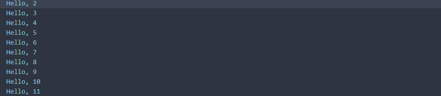
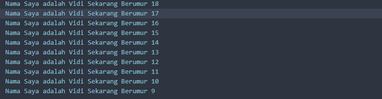

# Pemrograman Dart - Week 1


## Soal 1
Modifikasilah kode pada baris 3 di VS Code atau Editor Code favorit Anda berikut ini agar mendapatkan keluaran (output) sesuai yang diminta!
```dart
void main(){
  for (int i = 0; i < 10>; i++) {
    print('hello ${i + 2}');
  }
}
```
Output yang diminta (Gantilah Fulan dengan nama Anda):

### Output yang Dihasilkan
```
Nama Saya adalah Fulan Sekarang berumur 18
Nama Saya adalah Fulan Sekarang berumur 17
Nama Saya adalah Fulan Sekarang berumur 16
Nama Saya adalah Fulan Sekarang berumur 15
Nama Saya adalah Fulan Sekarang berumur 14
Nama Saya adalah Fulan Sekarang berumur 13
Nama Saya adalah Fulan Sekarang berumur 12
Nama Saya adalah Fulan Sekarang berumur 11
Nama Saya adalah Fulan Sekarang berumur 10
Nama Saya adalah Fulan Sekarang berumur 9
```
### Jawaban
```dart
void main(){
  for (int i = 18; i > 8; i--) {
    print('Nama Saya adalah Vidi Sekarang Berumur $i');
  }
}
```

### Output yang Dihasilkan


## Soal 2 
### Mengapa sangat penting untuk memahami bahasa pemrograman Dart sebelum kita menggunakan framework Flutter ? Jelaskan!

**Dart adalah fondasi dari Flutter.** Berikut alasan mengapa pemahaman Dart sangat penting:

1. Karena Dart adalah satu-satunya bahasa pemrograman yang digunakan Flutter
2. Memudahkan dalam menulis dan memahami kode Flutter
3. Kemampuan men-debug aplikasi Flutter memerlukan pemahaman Dart

## Soal 3

### Rangkumlah materi dari codelab ini menjadi poin-poin penting yang dapat Anda gunakan untuk membantu proses pengembangan aplikasi mobile menggunakan framework Flutter.

* Dart adalah fondasi utama untuk membangun aplikasi dengan Flutter.
* Bahasa Dart modern dan fleksibel dengan fitur *garbage collection*.
* Sistem tipe data pada Dart sangat kuat dan aman.
* Dart bisa diubah menjadi kode native untuk performa cepat di mobile.
* Kompilasi JIT mempercepat pengembangan dengan fitur Hot Reload.
* Kompilasi AOT memastikan aplikasi rilis berjalan dengan sangat cepat.
* Sintaks Dart mirip dengan bahasa C, Java, atau JavaScript.
* Dart sepenuhnya mendukung paradigma pemrograman berorientasi objek.
* Operator yang tersedia di Dart sangat standar dan mudah dipahami.
* DartPad adalah alat online untuk mencoba kode Dart tanpa instalasi.

## Null Safety vs Late Variables

### Null Safety
**Null Safety** adalah fitur keamanan yang memastikan variabel tidak dapat memiliki nilai `null` secara tidak sengaja, mengurangi kemungkinan terjadinya runtime errors.

#### Contoh Null Safety:
```dart
void main() {
  // Nullable variable (bisa null)
  String? nullableString;
  nullableString = null; // ✅ Diperbolehkan
  nullableString = "Hello"; // ✅ Diperbolehkan
  
  // Non-nullable variable (tidak bisa null)
  String nonNullableString = "Hello World";
  // nonNullableString = null; // ❌ Error kompilasi
  
  print(nonNullableString); // ✅ Aman
  print(nullableString?.length ?? 0); // ✅ Safe access
}
```

### Late Variables
**Late variables** adalah variabel yang dideklarasikan terlebih dahulu tetapi diinisialisasi nanti, sebelum digunakan.

#### Contoh Late Variables:
```dart
void main() {
  // Deklarasi late variable
  late String lateString;
  late int lateNumber;
  
  // Inisialisasi sebelum digunakan
  lateString = "Hello from Late Variable";
  lateNumber = 42;
  
  // Menggunakan variable
  print(lateString); // Output: Hello from Late Variable
  print(lateNumber); // Output: 42
}
```

#### Contoh Late dengan Function:
```dart
late String expensiveCalculation;

void main() {
  // Late variable hanya diinisialisasi ketika pertama kali diakses
  expensiveCalculation = calculateSomething();
  print(expensiveCalculation);
}

String calculateSomething() {
  print("Calculating...");
  return "Result of expensive calculation";
}
```

### Perbedaan Utama:

| Aspek | Null Safety | Late Variables |
|-------|-------------|----------------|
| **Tujuan** | Mencegah null pointer errors | Menunda inisialisasi variable |
| **Keamanan** | Compile-time safety | Runtime initialization |
| **Penggunaan** | `String?` vs `String` | `late String` |
| **Manfaat** | Mengurangi bugs | Optimasi performa dan fleksibilitas |


