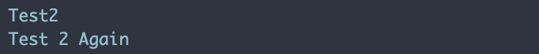
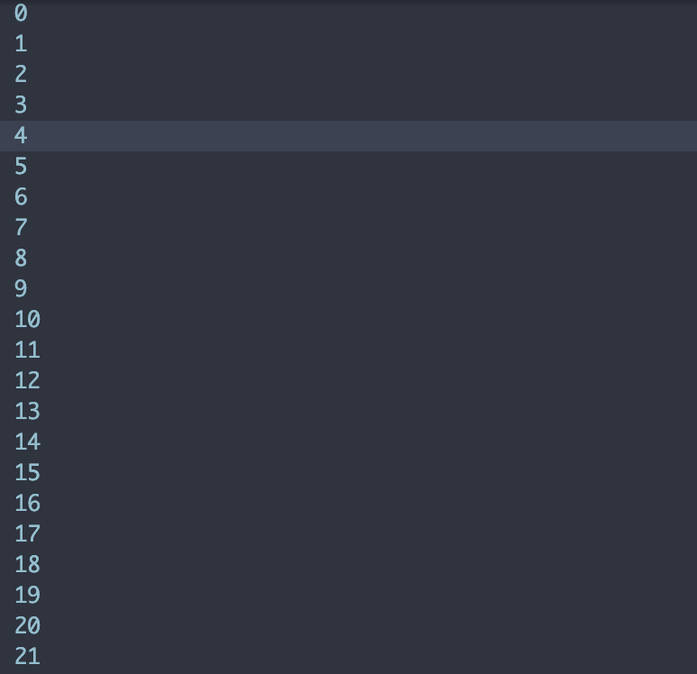
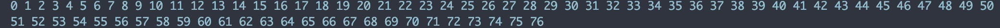
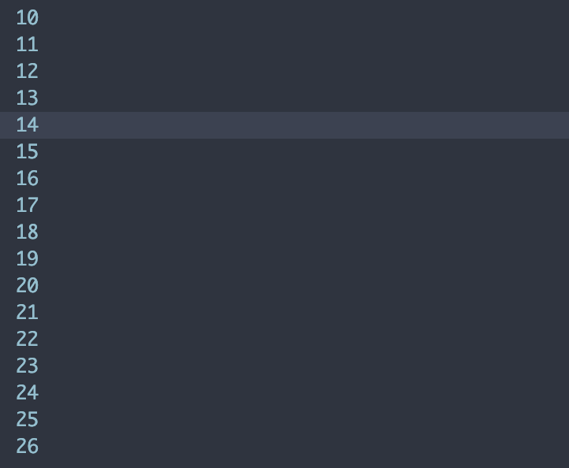
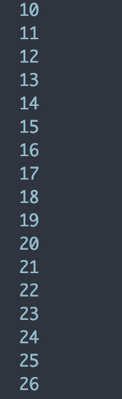
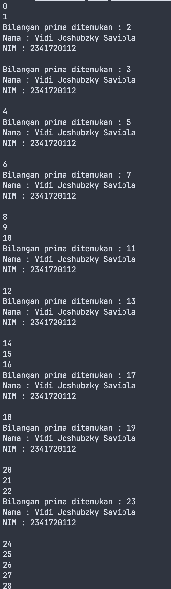

# Pemrograman Dart - Week

## Soal 1

Silakan selesaikan Praktikum 1 sampai 3, lalu dokumentasikan berupa screenshot hasil pekerjaan beserta penjelasannya!

### Praktikum 1: Menerapkan Control Flows ("if/else")

#### Langkah 1

```dart
void main() {
  String test = "test2";
  if (test == "test1") {
    print("Test1");
  } else if (test == "test2") {
    print("Test2");
  } else {
    print("Something else");
  }

  if (test == "Test2") print("Test 2 Again");
}
```

### Langkah 2

**Silakan coba eksekusi (Run) kode pada langkah 1 tersebut. Apa yang terjadi? Jelaskan!**



**Penjelasan:**

1. **Deklarasi variabel:**

   ```dart
   String test = "test2";
   ```

   Variabel `test` diisi dengan nilai `"test2"`.

2. **Percabangan if-else:**

   - `if (test == "test1")` → kondisi **salah** (karena `test` berisi `"test2"`).
   - `else if (test == "test2")` → kondisi **benar**, sehingga akan menampilkan:
     ```
     Test2
     ```
   - Bagian `else` tidak dijalankan.

3. **Percabangan if satu baris:**
   ```dart
   if (test == "test2") print("Test 2 Again");
   ```
   Kondisi **benar**, sehingga akan menampilkan:
   ```
   Test 2 Again
   ```

**Output yang dihasilkan:**

```
Test2
Test 2 Again
```

#### Langkah 3

```dart
void main() {
  bool test1 = true;
  if (test1) {
    print("kebenaran");
  }
}
```

### Praktikum 2: Menerapkan Perulangan "while" dan "do-while"

#### Langkah 1

```dart
void main() {
  int counter = 0;
  while (counter < 33) {
    print(counter);
    counter++;
  }
}
```

Output yang dihasilkan:


#### Langkah 2

**Silakan jelaskan apa yang terjadi pada kode program tersebut!**

**Penjelasan:**

1. **Deklarasi variabel counter:**

   ```dart
   int counter = 0;
   ```

   Variabel `counter` diinisialisasi dengan nilai 0.

2. **Perulangan while:**

   ```dart
   while (counter < 33) {
     print(counter);
     counter++;
   }
   ```

   - **Kondisi:** `counter < 33` - loop akan terus berjalan selama nilai counter kurang dari 33
   - **Body loop:**
     - `print(counter)` - menampilkan nilai counter saat ini
     - `counter++` - menambah nilai counter sebesar 1 (increment)

3. **Proses eksekusi:**
   - Iterasi 1: counter = 0, kondisi 0 < 33 (true) → print 0, counter menjadi 1
   - Iterasi 2: counter = 1, kondisi 1 < 33 (true) → print 1, counter menjadi 2
   - ...dan seterusnya...
   - Iterasi 33: counter = 32, kondisi 32 < 33 (true) → print 32, counter menjadi 33
   - Iterasi 34: counter = 33, kondisi 33 < 33 (false) → loop berhenti

**Output yang dihasilkan:**
Program akan menampilkan angka dari 0 sampai 32 (total 33 angka) secara berurutan.

#### Langkah 3

```dart
do {
    print($counter);
    counter++;
  } while (counter < 77);
```


**Penjelasan:**
1. **Perulangan do-while:**

   ```dart
   do {
       print(counter);
       counter++;
   } while (counter < 77);
   ```

   - **Body loop:** Kode di dalam blok `do` akan dieksekusi terlebih dahulu sebelum kondisi diperiksa.
     - `print(counter)` - menampilkan nilai counter saat ini.

###  Praktikum 3: Menerapkan Perulangan "for" dan "break-continue"

#### Langkah 1

```dart
void main() {
  for (int index = 10; index < 27; index++){
    print(index);
  }
}
```

#### Langkah 2

```dart
void main() {
  for (int index = 10; index < 27; index++){
    print(index);
  }
}
```

#### Langkah 2


**Silakan jelaskan apa yang terjadi pada kode program tersebut!**

**Penjelasan:**
1. **Deklarasi perulangan for:**

   ```dart
   for (int index = 10; index < 27; index++){
     print(index);
   }
   ```

   - `int index = 10` → inisialisasi variabel `index` dengan nilai awal 10.
   - `index < 27` → kondisi perulangan, loop akan terus berjalan selama `index` kurang dari 27.
   - `index++` → increment, menambah nilai `index` sebesar 1 setiap kali loop selesai.

### Langkah 3
````dart
void main() {
  for (int index = 10; index < 27; index++){
    if (index == 15) {
      continue;
    }
    print(index);
  }
}
````


**Penjelasan:**
1. **Perulangan for:**
    ```dart
    for (int index = 10; index < 27; index++){
    ```
    - Inisialisasi `index` dengan 10, loop berjalan selama `index` kurang dari 27, dan `index` bertambah 1 setiap iterasi.
2. **Kondisi if dengan continue:**
    ```dart
    if (index == 15) {
      continue;
    }
    ```
    - Ketika `index` mencapai 15, perintah `continue` akan dilewati, sehingga tidak mengeksekusi `print(index)` untuk nilai 15.
3. kodisi if dengan break:
    ```dart
    if (index == 20) {
      break;
    }
    ```
    - Ketika `index` mencapai 20, perintah `break` akan menghentikan seluruh perulangan.
4. **Output:**
    - Program akan mencetak angka dari 10 hingga 26, kecuali 15.

## Soal 2
**Buatlah sebuah program yang dapat menampilkan bilangan prima dari angka 0 sampai 201 menggunakan Dart. Ketika bilangan prima ditemukan, maka tampilkan nama lengkap dan NIM Anda.**

### Jawaban
```dart
void main() {
  for (int i = 0; i <= 201; i++) {
    bool isPrime = false;

    if (i > 1) {
      isPrime = true;
      for (int j = 2; j <= i / 2; j++) {
        if (i % j == 0) {
          isPrime = false;
          break;
        }
      }
    }

    if (isPrime) {
      print("Bilangan prima ditemukan : $i");
      print("Nama : Vidi Joshubzky Saviola");
      print("NIM : 2341720112");
      print(""); // Baris kosong untuk pemisah
    } else {
      print(i);
    }
  }
}
```
### Output yang Dihasilkan
