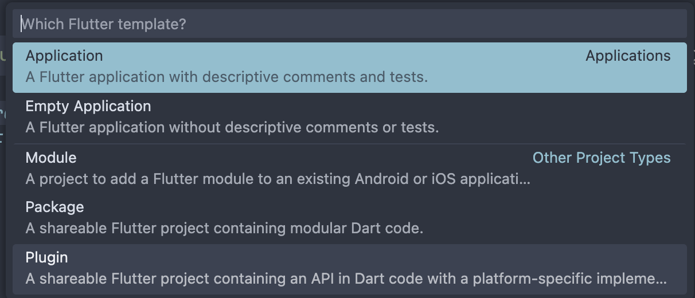
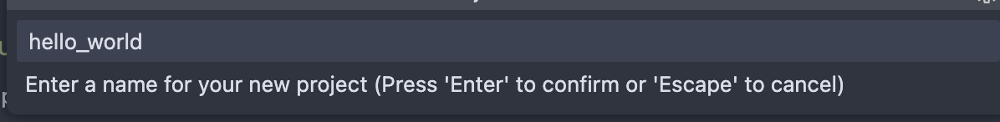
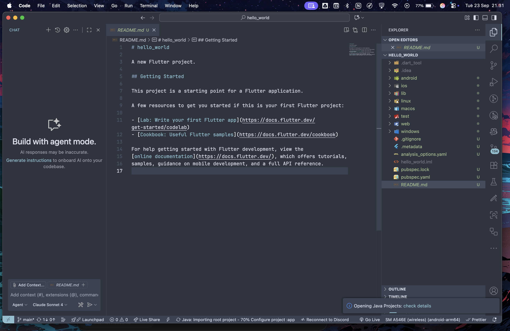
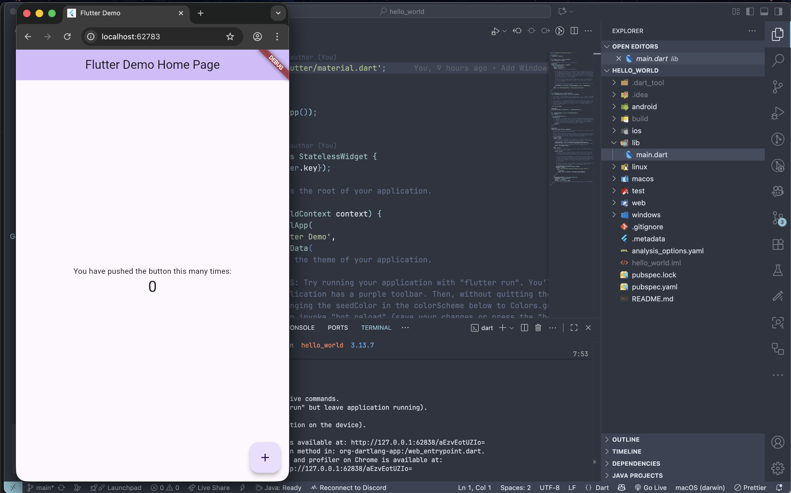

# Pemrograman Dart - Week 04

Nama: Vidi Joshubzky Saviola  
NIM: 2341720112

## Soal 1
Selesaikan Praktikum 1 sampai 5, lalu dokumentasikan dan push ke repository Anda berupa screenshot setiap hasil pekerjaan beserta penjelasannya di file README.md!

### Langkah 1
Buka VS Code, lalu tekan tombol Ctrl + Shift + P maka akan tampil Command Palette, lalu ketik Flutter. Pilih New Application Project.

### Langkah 2
Kemudian buat folder sesuai style laporan praktikum yang Anda pilih. Disarankan pada folder dokumen atau desktop atau alamat folder lain yang tidak terlalu dalam atau panjang. Lalu pilih Select a folder to create the project in.

### Langkah 3
Buat nama project flutter hello_world seperti berikut, lalu tekan Enter. Tunggu hingga proses pembuatan project baru selesai.

### Langkah 4
Jika sudah selesai proses pembuatan project baru, pastikan tampilan seperti berikut. Pesan akan tampil berupa "Your Flutter Project is ready!" artinya Anda telah berhasil membuat project Flutter baru.
