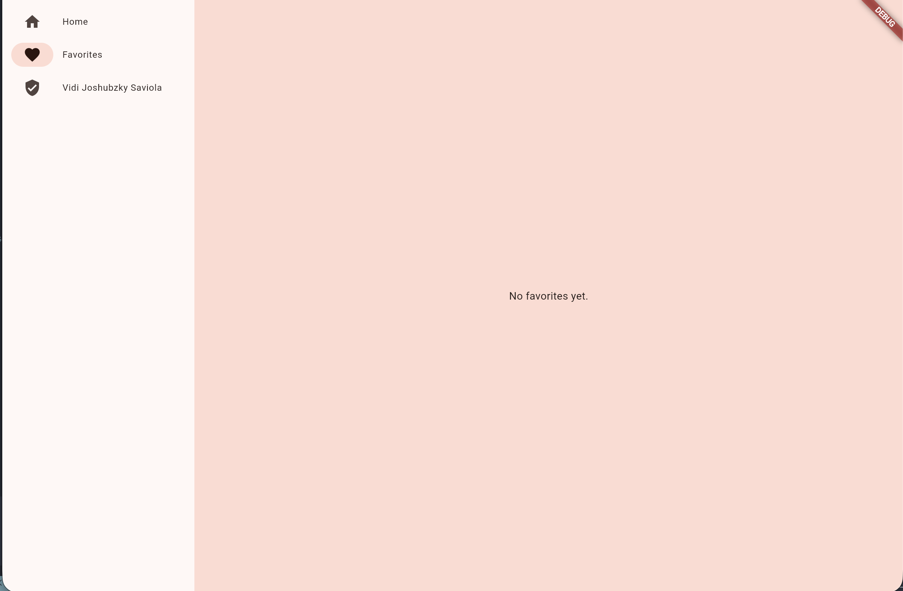

# Pemrograman Dart - Week 05

Nama: Vidi Joshubzky Saviola  
NIM: 2341720112

## Soal 1

Selesaikan Praktikum 1 sampai 5, lalu dokumentasikan dan push ke repository Anda berupa screenshot setiap hasil pekerjaan beserta penjelasannya di file README.md!

### Praktikum 1: Membuat Project Flutter Baru

#### Langkah 1

Buka VS Code, lalu tekan tombol Ctrl + Shift + P maka akan tampil Command Palette, lalu ketik Flutter. Pilih New Application Project.


#### Langkah 2

Kemudian buat folder sesuai style laporan praktikum yang Anda pilih. Disarankan pada folder dokumen atau desktop atau alamat folder lain yang tidak terlalu dalam atau panjang. Lalu pilih Select a folder to create the project in.


#### Langkah 3

Buat nama project flutter hello_world seperti berikut, lalu tekan Enter. Tunggu hingga proses pembuatan project baru selesai.


#### Langkah 4

Jika sudah selesai proses pembuatan project baru, pastikan tampilan seperti berikut. Pesan akan tampil berupa "Your Flutter Project is ready!" artinya Anda telah berhasil membuat project Flutter baru.


### Praktikum 2: Menghubungkan Perangkat Android atau Emulator

Melanjutkan dari praktikum 1, Anda diminta untuk menjalankan aplikasi ke perangkat fisik (device Android atau iOS). Silakan ikuti langkah-langkah pada codelab tautan berikut ini.


### Praktikum 3: Membuat Repository GitHub dan Laporan Praktikum

> Skip Langkah ini jika Anda sudah memiliki repository GitHub untuk menyimpan laporan praktikum.

### Praktikum 4: Menerapkan Widget Dasar

#### Langkah 1: Text Widget

Buat folder baru basic_widgets di dalam folder lib. Kemudian buat file baru di dalam basic_widgets dengan nama text_widget.dart. Ketik atau salin kode program berikut ke project hello_world Anda pada file text_widget.dart.

```dart
import 'package:flutter/material.dart';

class MyTextWidget extends StatelessWidget {
  const MyTextWidget({Key? key}) : super(key: key);

  @override
  Widget build(BuildContext context) {
    return const Text(
      "Nama saya Fulan, sedang belajar Pemrograman Mobile",
      style: TextStyle(color: Colors.red, fontSize: 14),
      textAlign: TextAlign.center);
  }
}
```


#### Langkah 2: Image Widget

Buat sebuah file image_widget.dart di dalam folder basic_widgets dengan isi kode berikut.

```dart
import 'package:flutter/material.dart';

class MyImageWidget extends StatelessWidget {
  const MyImageWidget({Key? key}) : super(key: key);

  @override
  Widget build(BuildContext context) {
    return const Image(
      image: AssetImage("logo_polinema.jpg")
    );
  }
}
```


### Praktikum 5: Menerapkan Widget Material Design dan iOS Cupertino

#### Langkah 1: Cupertino Button dan Loading Bar

Buat file di basic_widgets > loading_cupertino.dart. Import stateless widget dari material dan cupertino. Lalu isi kode di dalam method Widget build adalah sebagai berikut.

```dart
return MaterialApp(
      home: Container(
        margin: const EdgeInsets.only(top: 30),
        color: Colors.white,
        child: Column(
          children: <Widget>[
            CupertinoButton(
              child: const Text("Contoh button"),
              onPressed: () {},
            ),
            const CupertinoActivityIndicator(),
          ],
        ),
      ),
    );
```


#### Langkah 2: Floating Action Button (FAB)

Button widget terdapat beberapa macam pada flutter yaitu ButtonBar, DropdownButton, TextButton, FloatingActionButton, IconButton, OutlineButton, PopupMenuButton, dan ElevatedButton.

Buat file di basic_widgets > fab_widget.dart. Import stateless widget dari material. Lalu isi kode di dalam method Widget build adalah sebagai berikut.

```dart
return MaterialApp(
      home: Scaffold(
        floatingActionButton: FloatingActionButton(
          onPressed: () {
            // Add your onPressed code here!
          },
          child: const Icon(Icons.thumb_up),
          backgroundColor: Colors.pink,
        ),
      ),
    );

```


#### Langkah 3: Scaffold Widget

Scaffold widget digunakan untuk mengatur tata letak sesuai dengan material design.

Ubah isi kode main.dart seperti berikut.

```dart
import 'package:flutter/material.dart';

void main() {
  runApp(const MyApp());
}

class MyApp extends StatelessWidget {
  const MyApp({Key? key}) : super(key: key);

  // This widget is the root of your application.
  @override
  Widget build(BuildContext context) {
    return MaterialApp(
      title: 'Flutter Demo',
      theme: ThemeData(
        primarySwatch: Colors.red,
      ),
      home: const MyHomePage(title: 'My Increment App'),
    );
  }
}

class MyHomePage extends StatefulWidget {
  const MyHomePage({Key? key, required this.title}) : super(key: key);

  final String title;

  @override
  State<MyHomePage> createState() => _MyHomePageState();
}

class _MyHomePageState extends State<MyHomePage> {
  int _counter = 0;

  void _incrementCounter() {
    setState(() {
      _counter++;
    });
  }

  @override
  Widget build(BuildContext context) {
    return Scaffold(
      appBar: AppBar(
        title: Text(widget.title),
      ),
      body: Center(
        child: Column(
          mainAxisAlignment: MainAxisAlignment.center,
          children: <Widget>[
            const Text(
              'You have pushed the button this many times:',
            ),
            Text(
              '$_counter',
              style: Theme.of(context).textTheme.headline4,
            ),
          ],
        ),
      ),
      bottomNavigationBar: BottomAppBar(
        child: Container(
          height: 50.0,
        ),
      ),
      floatingActionButton: FloatingActionButton(
        onPressed: _incrementCounter,
        tooltip: 'Increment Counter',
        child: const Icon(Icons.add),
      ),
      floatingActionButtonLocation: FloatingActionButtonLocation.centerDocked,
    );
  }
}
```


#### Langkah 4: Dialog Widget

Dialog widget pada flutter memiliki dua jenis dialog yaitu AlertDialog dan SimpleDialog.

Ubah isi kode main.dart seperti berikut.

```dart
class MyApp extends StatelessWidget {
  const MyApp({Key? key}) : super(key: key);

  @override
  Widget build(BuildContext context) {
    return const MaterialApp(
      home: Scaffold(
        body: MyLayout(),
      ),
    );
  }
}

class MyLayout extends StatelessWidget {
  const MyLayout({Key? key}) : super(key: key);

  @override
  Widget build(BuildContext context) {
    return Padding(
      padding: const EdgeInsets.all(8.0),
      child: ElevatedButton(
        child: const Text('Show alert'),
        onPressed: () {
          showAlertDialog(context);
        },
      ),
    );
  }
}

showAlertDialog(BuildContext context) {
  // set up the button
  Widget okButton = TextButton(
    child: const Text("OK"),
    onPressed: () {
      Navigator.pop(context);
    },
  );

  // set up the AlertDialog
  AlertDialog alert = AlertDialog(
    title: const Text("My title"),
    content: const Text("This is my message."),
    actions: [
      okButton,
    ],
  );

  // show the dialog
  showDialog(
    context: context,
    builder: (BuildContext context) {
      return alert;
    },
  );
}
```


#### Langkah 5: Input dan Selection Widget

Flutter menyediakan widget yang dapat menerima input dari pengguna aplikasi yaitu antara lain Checkbox, Date and Time Pickers, Radio Button, Slider, Switch, TextField.

Contoh penggunaan TextField widget adalah sebagai berikut:

```dart
class MyApp extends StatelessWidget {
  const MyApp({Key? key}) : super(key: key);

  @override
  Widget build(BuildContext context) {
    return MaterialApp(
      home: Scaffold(
        appBar: AppBar(title: const Text("Contoh TextField")),
        body: const TextField(
          obscureText: false,
          decoration: InputDecoration(
            border: OutlineInputBorder(),
            labelText: 'Nama',
          ),
        ),
      ),
    );
  }
}
```


#### Langkah 6: Date and Time Pickers

Date and Time Pickers termasuk pada kategori input dan selection widget, berikut adalah contoh penggunaan Date and Time Pickers.

```dart
import 'dart:async';
import 'package:flutter/material.dart';

void main() => runApp(const MyApp());

class MyApp extends StatelessWidget {
  const MyApp({Key? key}) : super(key: key);

  @override
  Widget build(BuildContext context) {
    return const MaterialApp(
      title: 'Contoh Date Picker',
      home: MyHomePage(title: 'Contoh Date Picker'),
    );
  }
}

class MyHomePage extends StatefulWidget {
  const MyHomePage({Key? key, required this.title}) : super(key: key);

  final String title;

  @override
  _MyHomePageState createState() => _MyHomePageState();
}

class _MyHomePageState extends State<MyHomePage> {
  // Variable/State untuk mengambil tanggal
  DateTime selectedDate = DateTime.now();

  //  Initial SelectDate FLutter
  Future<void> _selectDate(BuildContext context) async {
    // Initial DateTime FIinal Picked
    final DateTime? picked = await showDatePicker(
        context: context,
        initialDate: selectedDate,
        firstDate: DateTime(2015, 8),
        lastDate: DateTime(2101));
    if (picked != null && picked != selectedDate) {
      setState(() {
        selectedDate = picked;
      });
    }
  }

  @override
  Widget build(BuildContext context) {
    return Scaffold(
      appBar: AppBar(
        title: Text(widget.title),
      ),
      body: Center(
        child: Column(
          mainAxisSize: MainAxisSize.min,
          children: <Widget>[
            Text("${selectedDate.toLocal()}".split(' ')[0]),
            const SizedBox(
              height: 20.0,
            ),
            ElevatedButton(
              onPressed: () => {
                _selectDate(context),
                // ignore: avoid_print
                print(selectedDate.day + selectedDate.month + selectedDate.year)
              },
              child: const Text('Pilih Tanggal'),
            ),
          ],
        ),
      ),
    );
  }
}
```


## 2. Selesaikan Codelabs: Your first Flutter app, lalu buatlah laporan praktikumnya dan push ke repository GitHub Anda!

### Codelab: Your First Flutter App (namer_app)

Codelab ini mengajarkan cara membuat aplikasi Flutter pertama yang berupa generator nama random dengan fitur favorit.

#### Langkah 1: Membuat Project Flutter Baru

Membuat project Flutter baru dengan nama `namer_app` menggunakan command palette VS Code dengan perintah "Flutter: New Application Project".


**Penjelasan**: Project Flutter baru telah dibuat dengan nama `namer_app`. Project ini akan menjadi aplikasi generator nama random yang interaktif menggunakan package `english_words` dan `provider` untuk state management.

#### Langkah 2: Menambahkan Dependencies dan Konfigurasi




**Penjelasan**: Aplikasi berhasil dijalankan dengan dependencies yang diperlukan. Package `english_words` digunakan untuk generate kata random, sedangkan `provider` untuk state management yang efisien.

#### Langkah 3: Implementasi Name Generator dengan Navigation

Mengimplementasikan aplikasi generator nama lengkap dengan fitur navigation, favorit, dan responsive design.

**Kode lengkap main.dart:**

```dart
import 'package:english_words/english_words.dart';
import 'package:flutter/material.dart';
import 'package:provider/provider.dart';

void main() {
  runApp(MyApp());
}

class MyApp extends StatelessWidget {
  const MyApp({super.key});

  @override
  Widget build(BuildContext context) {
    return ChangeNotifierProvider(
      create: (context) => MyAppState(),
      child: MaterialApp(
        title: 'Namer App',
        theme: ThemeData(
          useMaterial3: true,
          colorScheme: ColorScheme.fromSeed(seedColor: Colors.deepOrange),
        ),
        home: MyHomePage(),
      ),
    );
  }
}

class MyAppState extends ChangeNotifier {
  var current = WordPair.random();

  void getNext() {
    current = WordPair.random();
    notifyListeners();
  }

  var favorites = <WordPair>[];

  void toggleFavorite() {
    if (favorites.contains(current)) {
      favorites.remove(current);
    } else {
      favorites.add(current);
    }
    notifyListeners();
  }
}

class MyHomePage extends StatefulWidget {
  @override
  State<MyHomePage> createState() => _MyHomePageState();
}

class _MyHomePageState extends State<MyHomePage> {
  var selectedIndex = 0;

  @override
  Widget build(BuildContext context) {
    Widget page;
    switch (selectedIndex) {
      case 0:
        page = GeneratorPage();
        break;
      case 1:
        page = FavoritesPage();
        break;
      default:
        throw UnimplementedError('no widget for $selectedIndex');
    }

    return LayoutBuilder(
      builder: (context, constraints) {
        return Scaffold(
          body: Row(
            children: [
              SafeArea(
                child: NavigationRail(
                  extended: constraints.maxWidth >= 600,
                  destinations: [
                    NavigationRailDestination(
                      icon: Icon(Icons.home),
                      label: Text('Home'),
                    ),
                    NavigationRailDestination(
                      icon: Icon(Icons.favorite),
                      label: Text('Favorites'),
                    ),
                  ],
                  selectedIndex: selectedIndex,
                  onDestinationSelected: (value) {
                    setState(() {
                      selectedIndex = value;
                    });
                  },
                ),
              ),
              Expanded(
                child: Container(
                  color: Theme.of(context).colorScheme.primaryContainer,
                  child: page,
                ),
              ),
            ],
          ),
        );
      }
    );
  }
}

class GeneratorPage extends StatelessWidget {
  @override
  Widget build(BuildContext context) {
    var appState = context.watch<MyAppState>();
    var pair = appState.current;

    IconData icon;
    if (appState.favorites.contains(pair)) {
      icon = Icons.favorite;
    } else {
      icon = Icons.favorite_border;
    }

    return Center(
      child: Column(
        mainAxisAlignment: MainAxisAlignment.center,
        children: [
          BigCard(pair: pair),
          SizedBox(height: 10),
          Row(
            mainAxisSize: MainAxisSize.min,
            children: [
              ElevatedButton.icon(
                onPressed: () {
                  appState.toggleFavorite();
                },
                icon: Icon(icon),
                label: Text('Like'),
              ),
              SizedBox(width: 10),
              ElevatedButton(
                onPressed: () {
                  appState.getNext();
                },
                child: Text('Next'),
              ),
            ],
          ),
        ],
      ),
    );
  }
}

class BigCard extends StatelessWidget {
  const BigCard({
    super.key,
    required this.pair,
  });

  final WordPair pair;

  @override
  Widget build(BuildContext context) {
    final theme = Theme.of(context);
    final style = theme.textTheme.displayMedium!.copyWith(
      color: theme.colorScheme.onPrimary,
    );

    return Card(
      color: theme.colorScheme.primary,
      child: Padding(
        padding: const EdgeInsets.all(20),
        child: Text(
          pair.asLowerCase,
          style: style,
          semanticsLabel: "${pair.first} ${pair.second}",
        ),
      ),
    );
  }
}

class FavoritesPage extends StatelessWidget {
  @override
  Widget build(BuildContext context) {
    var appState = context.watch<MyAppState>();

    if (appState.favorites.isEmpty) {
      return Center(
        child: Text('No favorites yet.'),
      );
    }

    return ListView(
      children: [
        Padding(
          padding: const EdgeInsets.all(20),
          child: Text('You have '
              '${appState.favorites.length} favorites:'),
        ),
        for (var pair in appState.favorites)
          ListTile(
            leading: Icon(Icons.favorite),
            title: Text(pair.asLowerCase),
          ),
      ],
    );
  }
}
```


## 3. README.md berisi: capture hasil akhir tiap praktikum (side-by-side, bisa juga berupa file GIF agar terlihat proses perubahan ketika ada aksi dari pengguna) dengan menampilkan NIM dan Nama Anda sebagai ciri pekerjaan Anda.
