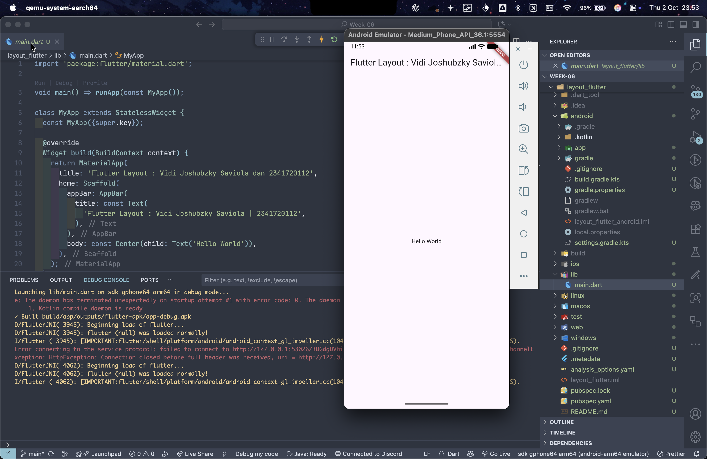
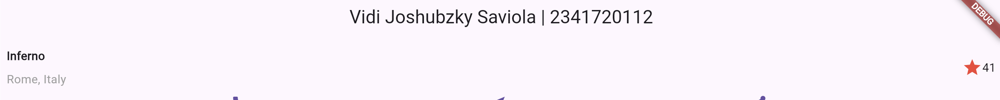
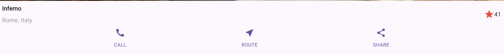
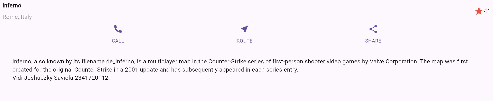
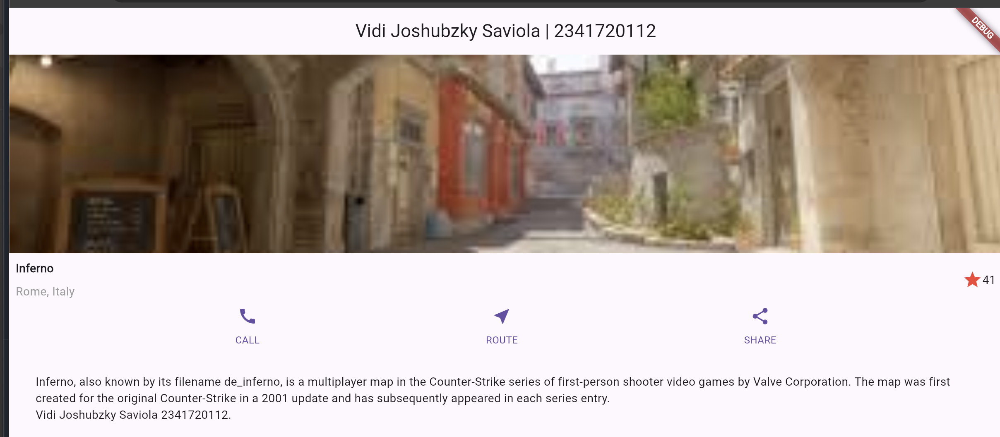
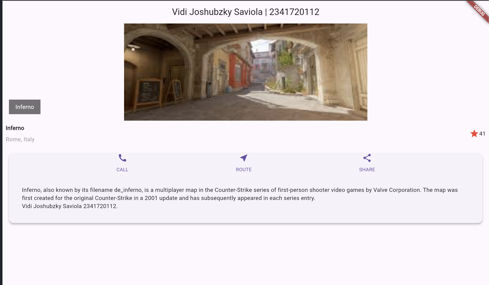
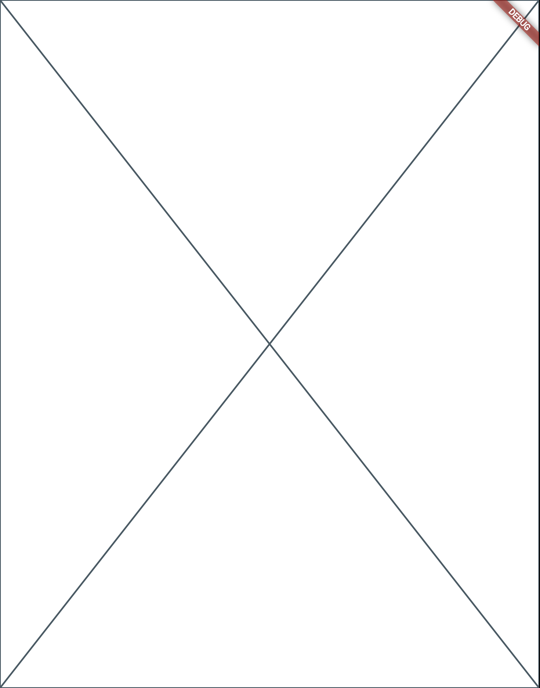

# Tugas Praktikum 1

## 1.Selesaikan Praktikum 1 sampai 4, lalu dokumentasikan dan push ke repository Anda berupa screenshot setiap hasil pekerjaan beserta penjelasannya di file README.md!

### Praktikum 1: Membangun Layout di Flutter

#### Langkah 1: Buat Project Baru

Buatlah sebuah project flutter baru dengan nama layout_flutter. Atau sesuaikan style laporan praktikum yang Anda buat.

#### Langkah 2: Buka file lib/main.dart

Buka file main.dart lalu ganti dengan kode berikut. Isi nama dan NIM Anda di text title.

Hasil:\


#### Langkah 3: Identifikasi layout diagram

Langkah pertama adalah memecah tata letak menjadi elemen dasarnya:

- ### Identifikasi baris dan kolom.

  - Kolom utama (Column):
    - Gambar utama
    - Title section (Row):
      - Column:
        - Title
        - Subtitle
      - Spacer
      - Row:
        - Ikon bintang
        - Jumlah bintang
    - Button section:
      - Row:
        - Ikon
        - Text
      - Row:
        - Ikon
        - Text
      - Row:
        - Ikon
        - Text
    - Blok Teks Deskripsi

- ### Apakah tata letaknya menyertakan kisi-kisi (grid)?
  Tidak
- ### Apakah ada elemen yang tumpang tindih?
  Tidak
- ### Apakah UI memerlukan tab?
  TIdak
- ### Perhatikan area yang memerlukan alignment, padding, atau borders.
  - Title section: `CrossAxisAlignment` pada column adalah start
  - Kolom teks di dalam baris judul dapat diberi Spacer/Expanded agar mengambil ruang sisa.
  - Teks dalam blok deskripsi perlu Padding agar tidak mepet ke tepi layar.

#### Langkah 4: Implementasi title row

Pertama, Anda akan membuat kolom bagian kiri pada judul. Tambahkan kode berikut di bagian atas metode build() di dalam kelas MyApp:

```dart
Widget titleSection = Container(
  padding: const EdgeInsets.all(8.0),
  child: Row(
    children: [
      Expanded(
        /* soal 1*/
        child: Column(
          crossAxisAlignment: CrossAxisAlignment.start,
          children: [
            /* soal 2*/
            Container(
              padding: const EdgeInsets.only(bottom: 8.0),
              child: const Text(
                'Kivotos night',
                style: TextStyle(fontWeight: FontWeight.bold),
              ),
            ),
            Text('Tokyo, Japan', style: TextStyle(color: Colors.grey[500])),
          ],
        ),
      ),
      /* soal 3*/
      Icon(Icons.star, color: Colors.red[500]),
      const Text("41"),
    ],
  ),
);
```

**soal 1** Letakkan widget Column di dalam widget Expanded agar menyesuaikan ruang yang tersisa di dalam widget Row. Tambahkan properti crossAxisAlignment ke CrossAxisAlignment.start sehingga posisi kolom berada di awal baris.

**soal 2** Letakkan baris pertama teks di dalam Container sehingga memungkinkan Anda untuk menambahkan padding = 8. Teks ‘Batu, Malang, Indonesia' di dalam Column, set warna menjadi abu-abu.

**soal 3** Dua item terakhir di baris judul adalah ikon bintang, set dengan warna merah, dan teks "41". Seluruh baris ada di dalam Container dan beri padding di sepanjang setiap tepinya sebesar 32 piksel. Kemudian ganti isi body text ‘Hello World' dengan variabel titleSection

Hasil:\


### Praktikum 2: Implementasi button row

#### Langkah 1: Buat method Column \_buildButtonColumn

```dart
Column _buildButtonColumn(Color color, IconData icon, String label) {
  return Column(
    mainAxisSize: MainAxisSize.min,
    mainAxisAlignment: MainAxisAlignment.center,
    children: [
      Icon(icon, color: color),
      Container(
        margin: const EdgeInsets.only(top: 8),
        child: Text(
          label,
          style: TextStyle(
            fontSize: 12,
            fontWeight: FontWeight.w400,
            color: color,
          ),
        ),
      ),
    ],
  );
}
```

#### Langkah 2: Buat widget buttonSection

```dart
Color color = Theme.of(context).primaryColor;
Widget buttonSection = Row(
  mainAxisAlignment: MainAxisAlignment.spaceEvenly,
  children: [
    _buildButtonColumn(color, Icons.call, 'CALL'),
    _buildButtonColumn(color, Icons.near_me, 'ROUTE'),
    _buildButtonColumn(color, Icons.share, 'SHARE'),
  ],
);
```

#### Langkah 3: Tambah button section ke body

```dart
home: Scaffold(
//
  body: Column(children: [titleSection, buttonSection]),
),
```

Hasil:\


### Praktikum 3: Implementasi text section

#### Langkah 1: Buat widget textSection

```dart
Widget textSection = Container(
  padding: const EdgeInsets.all(32),
  child: const Text(
    'Pemandangan kota futuristik pada malam hari dengan menara yang menjulang tinggi, di bawah langit berbintang yang dihiasi lingkaran-lingkaran cahaya biru. '
    '\nVidi Joshubzky Saviola '
    '2341720112. ',
    softWrap: true,
  ),
);
```

#### Langkah 2: Tambahkan variabel text section ke body

```dart
home: Scaffold(
//
  body: Column(children: [titleSection, buttonSection, textSection]),
),
```

Hasil:\


### Praktikum 4: Implementasi image section

#### Langkah 1: Siapkan aset gambar

Gambar:\


#### Langkah 2: Tambahkan gambar ke body

```dart
home: Scaffold(
//
  body: Column(
    children: [
      Image.asset(
        'imgs/inferno.jpg',
        width: 600,
        height: 240,
        fit: BoxFit.cover,
      ),
      titleSection,
      buttonSection,
      textSection,
    ],
  ),
),
```

#### Langkah 3: Terakhir, ubah menjadi ListView

```dart
home: Scaffold(
//
  body: ListView(
    children: [
      Image.asset(
        'imgs/inferno.jpg',
        width: 600,
        height: 240,
        fit: BoxFit.cover,
      ),
      titleSection,
      buttonSection,
      textSection,
    ],
  ),
),
```

Hasil:\


## 2. Silakan implementasikan di project baru "basic_layout_flutter" dengan mengakses sumber ini: https://docs.flutter.dev/codelabs/layout-basics

#### Menambahk/menerapkan stack dan card

```dart
return MaterialApp(
  title: 'Flutter layout: Vidi Joshubzky Saviola dan 2341720112',
  home: Scaffold(
    appBar: AppBar(title: const Text('Vidi Joshubzky Saviola | 2341720112')),
    body: ListView(
      children: [
        Stack(
          alignment: AlignmentDirectional.center,
          children: [
            Image.asset(
              'imgs/kivotos_night.jpg',
              width: 600,
              height: 240,
              fit: BoxFit.cover,
            ),
            Positioned(
              bottom: 16,
              left: 16,
              child: Container(
                padding: const EdgeInsets.symmetric(
                  vertical: 8.0,
                  horizontal: 16.0,
                ),
                color: Colors.black54,
                child: const Text(
                  'Kivotos night',
                  style: TextStyle(color: Colors.white),
                ),
              ),
            ),
          ],
        ),
        titleSection,
        Card(
          elevation: 4.0,
          margin: EdgeInsets.all(16.0),
          child: Column(children: [buttonSection, textSection]),
        ),
      ],
    ),
  ),
);
```

Sehingga hasil akhirnya:\


## 3. Kumpulkan link commit repository GitHub Anda kepada dosen yang telah disepakati!

# Praktikum 5: Membangun Navigasi di Flutter

## Langkah 1: Siapkan project baru

Sebelum melanjutkan praktikum, buatlah sebuah project baru Flutter dengan nama `belanja` dan susunan folder seperti pada gambar berikut. Penyusunan ini dimaksudkan untuk mengorganisasi kode dan widget yang lebih mudah.

## Langkah 2: Mendefinisikan Route

Buatlah dua buah file dart dengan nama `home_page.dart` dan `item_page.dart` pada folder pages. Untuk masing-masing file, deklarasikan class HomePage pada file `home_page.dart` dan ItemPage pada `item_page.dart`. Turunkan class dari `StatelessWidget`. Gambaran potongan kode dapat anda lihat sebagai berikut.

## Langkah 3: Lengkapi Kode di main.dart

Setelah kedua halaman telah dibuat dan didefinisikan, bukalah file main.dart. Pada langkah ini anda akan mendefinisikan Route untuk kedua halaman tersebut. Definisi penamaan route harus bersifat unique. Halaman HomePage didefinisikan sebagai /. Dan halaman ItemPage didefinisikan sebagai /item. Untuk mendefinisikan halaman awal, anda dapat menggunakan named argument initialRoute. Gambaran tahapan ini, dapat anda lihat pada potongan kode berikut.

```dart
void main() {
  runApp(
    MaterialApp(
      initialRoute: '/',
      routes: {
        '/': (context) => const HomePage(),
        '/item': (context) => const ItemPage(),
      },
    ),
  );
}
```

## Langkah 4: Membuat data model

Sebelum melakukan perpindahan halaman dari HomePage ke ItemPage, dibutuhkan proses pemodelan data. Pada desain mockup, dibutuhkan dua informasi yaitu nama dan harga. Untuk menangani hal ini, buatlah sebuah file dengan nama item.dart dan letakkan pada folder models. Pada file ini didefinisikan pemodelan data yang dibutuhkan. Ilustrasi kode yang dibutuhkan, dapat anda lihat pada potongan kode berikut.

```dart
class Item {
  String name;
  int price;

  Item({required this.name, required this.price});
}
```

## Langkah 5: Lengkapi kode di class HomePage

Pada halaman HomePage terdapat ListView widget. Sumber data ListView diambil dari model List dari object Item. Gambaran kode yang dibutuhkan untuk melakukan definisi model dapat anda lihat sebagai berikut.

```dart
class HomePage extends StatelessWidget {
  //

  final List<Item> items = [
    Item(name: 'Sugar', price: 5000),
    Item(name: 'Salt', price: 2000),
  ];
}
```

## Langkah 6: Membuat ListView dan itemBuilder

Untuk menampilkan ListView pada praktikum ini digunakan itemBuilder. Data diambil dari definisi model yang telah dibuat sebelumnya. Untuk menunjukkan batas data satu dan berikutnya digunakan widget Card. Kode yang telah umum pada bagian ini tidak ditampilkan. Gambaran kode yang dibutuhkan dapat anda lihat sebagai berikut.

```dart
Widget build(BuildContext context) {
  return Scaffold(
    body: Container(
      margin: EdgeInsets.all(8),
      child: ListView.builder(
        padding: EdgeInsets.all(8),
        itemCount: items.length,
        itemBuilder: (context, index) {
        final item = items[index];
          return Card(
            child: Container(
              margin: EdgeInsets.all(8),
              child: Row(
                children: [
                  Expanded(child: Text(item.name)),
                Expanded(
                    child: Text(
                      item.price.toString(),
                      textAlign: TextAlign.end,
                    ),
                  ),
                ],
              ),
            ),
          );
        },
      ),
    ),
  );
}
```

## Langkah 7: Menambahkan aksi pada ListView

Item pada ListView saat ini ketika ditekan masih belum memberikan aksi tertentu. Untuk menambahkan aksi pada ListView dapat digunakan widget InkWell atau GestureDetector. Perbedaan utamanya InkWell merupakan material widget yang memberikan efek ketika ditekan. Sedangkan GestureDetector bersifat umum dan bisa juga digunakan untuk gesture lain selain sentuhan. Pada praktikum ini akan digunakan widget InkWell.

```dart
//
itemBuilder: (context, index) {
            final item = items[index];
            return InkWell(
              onTap: () => Navigator.pushNamed(context, '/item'),
              child: Card(
//
```

Hasil:\


# Tugas Praktikum 2

1. Untuk melakukan pengiriman data ke halaman berikutnya, cukup menambahkan informasi arguments pada penggunaan Navigator.Perbarui kode pada bagian Navigator menjadi seperti berikut.

   ```dart
    onTap: () =>
        Navigator.pushNamed(context, '/item', arguments: item),
   ```

2. Pembacaan nilai yang dikirimkan pada halaman sebelumnya dapat dilakukan menggunakan ModalRoute. Tambahkan kode berikut pada blok fungsi build dalam halaman ItemPage. Setelah nilai didapatkan, anda dapat menggunakannya seperti penggunaan variabel pada umumnya. (https://docs.flutter.dev/cookbook/navigation/navigate-with-arguments)

   ```dart
   final itemArgs = ModalRoute.of(context)!.settings.arguments as Item;
   ```


3. Pada hasil akhir dari aplikasi belanja yang telah anda selesaikan, tambahkan atribut foto produk, stok, dan rating. Ubahlah tampilan menjadi GridView seperti di aplikasi marketplace pada umumnya.

<details>
<summary>Expand Code home_page.dart:</summary>

```dart
import 'package:belanja/models/item.dart';
import 'package:belanja/widgets/shop_card_item.dart';
import 'package:flutter/material.dart';

class HomePage extends StatelessWidget {
  HomePage({super.key});

  final List<Item> items = [
    Item(
      name: 'Bawang Goreng',
      price: 2500,
      imgPath: 'images/bgoreng.webp',
      stok: 50,
      rating: 4.8,
    ),
    Item(
      name: 'Garam',
      price: 2000,
      imgPath: 'images/garam.webp',
      stok: 57,
      rating: 4.7,
    ),
    Item(
      name: 'Gula',
      price: 5000,
      imgPath: 'images/gula.webp',
      rating: 5.0,
      stok: 100,
    ),

    Item(
      name: 'Kopi',
      price: 10000,
      imgPath: 'images/kopi.webp',
      stok: 900,
      rating: 4.1,
    ),
    Item(
      name: 'Minyak Goreng',
      price: 47000,
      imgPath: 'images/minyak.webp',
      stok: 13,
      rating: 4.6,
    ),
    Item(
      name: 'Teh',
      price: 5000,
      imgPath: 'images/teh.jpg',
      stok: 100,
      rating: 4.9,
    ),
  ];

  @override
  Widget build(BuildContext context) {
    return Scaffold(
      backgroundColor: Colors.white,
      appBar: AppBar(
        title: Text(
          'Belanja by Vidi Joshubzky Saviola | 2341720112',
          overflow: TextOverflow.ellipsis,
        ),
        elevation: 0,
        backgroundColor: Colors.white,
        foregroundColor: Colors.black,
      ),
      body: Padding(
        padding: const EdgeInsets.all(12.0),
        child: GridView.builder(
          gridDelegate: SliverGridDelegateWithFixedCrossAxisCount(
            crossAxisCount: 2,
            crossAxisSpacing: 12,
            mainAxisSpacing: 12,
            childAspectRatio: 0.78,
          ),
          itemCount: items.length,
          itemBuilder: (context, index) {
            final item = items[index];
            return ShopCardItem(
              onTap: () =>
                  Navigator.pushNamed(context, '/item', arguments: item),
              item: item,
            );
          },
        ),
      ),
    );
  }
}
```

</details>

<details>
<summary>Expand Code shop_card_item.dart:</summary>

```dart
import 'package:belanja/models/item.dart';
import 'package:flutter/material.dart';

class ShopCardItem extends StatelessWidget {
const ShopCardItem({super.key, required this.item, required this.onTap});

final Item item;
final Function() onTap;

@override
Widget build(BuildContext context) {
return InkWell(
borderRadius: BorderRadius.circular(12),
onTap: onTap,
child: Card(
shape: RoundedRectangleBorder(borderRadius: BorderRadius.circular(12)),
elevation: 2,
color: Colors.white,
child: Column(
crossAxisAlignment: CrossAxisAlignment.stretch,
children: [
Expanded(
flex: 6,
child: ClipRRect(
borderRadius: BorderRadius.vertical(top: Radius.circular(12)),
child: Image.asset(
item.imgPath,
fit: BoxFit.cover,
errorBuilder: (context, error, stackTrace) => Container(
color: Colors.grey[200],
child: Center(
child: Icon(
Icons.image_not_supported,
color: Colors.grey,
size: 40,
),
),
),
),
),
),
Expanded(
flex: 4,
child: Padding(
padding: const EdgeInsets.symmetric(
horizontal: 10,
vertical: 8,
),
child: Column(
crossAxisAlignment: CrossAxisAlignment.start,
mainAxisAlignment: MainAxisAlignment.spaceBetween,
children: [
Text(
item.name,
style: TextStyle(fontWeight: FontWeight.w600),
maxLines: 2,
overflow: TextOverflow.ellipsis,
),
Row(
mainAxisAlignment: MainAxisAlignment.spaceBetween,
children: [
Row(
children: [
Icon(Icons.star, size: 14, color: Colors.amber),
SizedBox(width: 4),
Text(
item.rating.toString(),
style: TextStyle(
fontSize: 12,
color: Colors.black54,
),
),
],
),
Text(
'Rp ${item.price}',
style: TextStyle(fontWeight: FontWeight.w700),
),
],
),
],
),
),
),
],
),
),
);
}
}

```

</details>

<details>
<summary>Expand Code item_page.dart:</summary>

```dart
import 'package:belanja/models/item.dart';
import 'package:flutter/material.dart';

class ItemPage extends StatelessWidget {
  const ItemPage({super.key});

  @override
  Widget build(BuildContext context) {
    final itemArgs = ModalRoute.of(context)!.settings.arguments as Item;
    return Scaffold(
      backgroundColor: Colors.white,
      appBar: AppBar(
        backgroundColor: Colors.white,
        foregroundColor: Colors.black,
        elevation: 0,
        title: Text(itemArgs.name, style: TextStyle(fontSize: 16)),
      ),
      body: Padding(
        padding: const EdgeInsets.all(16.0),
        child: Column(
          crossAxisAlignment: CrossAxisAlignment.stretch,
          children: [
            AspectRatio(
              aspectRatio: 16 / 10,
              child: ClipRRect(
                borderRadius: BorderRadius.circular(12),
                child: Image.asset(
                  itemArgs.imgPath,
                  fit: BoxFit.cover,
                  errorBuilder: (context, error, stackTrace) => Container(
                    color: Colors.grey[200],
                    child: Center(
                      child: Icon(
                        Icons.image_not_supported,
                        color: Colors.grey,
                        size: 48,
                      ),
                    ),
                  ),
                ),
              ),
            ),
            SizedBox(height: 16),
            Text(
              itemArgs.name,
              style: TextStyle(fontSize: 22, fontWeight: FontWeight.w700),
            ),
            SizedBox(height: 8),
            Text(
              'Rp ${itemArgs.price}',
              style: TextStyle(
                fontSize: 18,
                fontWeight: FontWeight.w600,
                color: Colors.black87,
              ),
            ),
            SizedBox(height: 12),
            Row(
              mainAxisAlignment: MainAxisAlignment.spaceBetween,
              children: [
                Row(
                  children: [
                    Icon(Icons.star, color: Colors.amber, size: 18),
                    SizedBox(width: 6),
                    Text(
                      itemArgs.rating.toString(),
                      style: TextStyle(fontSize: 14),
                    ),
                  ],
                ),
                Text(
                  'Stok: ${itemArgs.stok}',
                  style: TextStyle(fontSize: 14, color: Colors.black54),
                ),
              ],
            ),
            Spacer(),
            ElevatedButton(
              style: ElevatedButton.styleFrom(
                padding: EdgeInsets.symmetric(vertical: 14),
                shape: RoundedRectangleBorder(
                  borderRadius: BorderRadius.circular(10),
                ),
              ),
              onPressed: () {
                ScaffoldMessenger.of(context).showSnackBar(
                  SnackBar(
                    content: Text('${itemArgs.name} ditambahkan ke keranjang'),
                  ),
                );
              },
              child: Text(
                'Tambah ke Keranjang',
                style: TextStyle(fontSize: 16),
              ),
            ),
          ],
        ),
      ),
    );
  }
}
```

</details>

Hasilnya:\

4. Silakan implementasikan Hero widget pada aplikasi belanja Anda dengan mempelajari dari sumber ini: https://docs.flutter.dev/cookbook/navigation/hero-animations

```dart
// Menambahkan Hero pada widget asal
child: Hero(
  tag: itemArgs.imgPath,
  child: Image.asset(
    itemArgs.imgPath,

// Menambahkan Hero pada widget tujuan
child: Hero(
  tag: item.imgPath,
  child: Image.asset(
    item.imgPath,
```

Hasil:\


5. Sesuaikan dan modifikasi tampilan sehingga menjadi aplikasi yang menarik. Selain itu, pecah widget menjadi kode yang lebih kecil. Tambahkan Nama dan NIM di footer aplikasi belanja Anda.

6. Selesaikan Praktikum 5: Navigasi dan Rute tersebut. Cobalah modifikasi menggunakan plugin go_router, lalu dokumentasikan dan push ke repository Anda berupa screenshot setiap hasil pekerjaan beserta penjelasannya di file README.md. Kumpulkan link commit repository GitHub Anda kepada dosen yang telah disepakati!

#### Membuat konfigurasi go_router, `router.dart`:

```dart
final router = GoRouter(
  routes: [
    GoRoute(path: '/', builder: (context, state) => HomePage()),
    GoRoute(
      path: '/item',
      redirect: (context, state) => state.extra == null ? '/' : null,
      builder: (context, state) => ItemPage(itemArgs: state.extra as Item),
    ),
  ],
);
```

#### Menggunakan MaterialApp.router dan menggunkan konfigurasi router

```dart
return MaterialApp.router(
  routerConfig: router,
  theme: ThemeData(
    colorScheme: ColorScheme.fromSeed(seedColor: Colors.pinkAccent),
    useMaterial3: true,
  ),
);
```

#### Menggunakan `context.go` untuk berpindah, misal:

```dart
context.go('/item', extra: item) // extra untuk mengirim objek
```

Hasi:\

