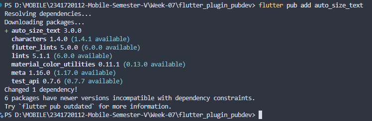
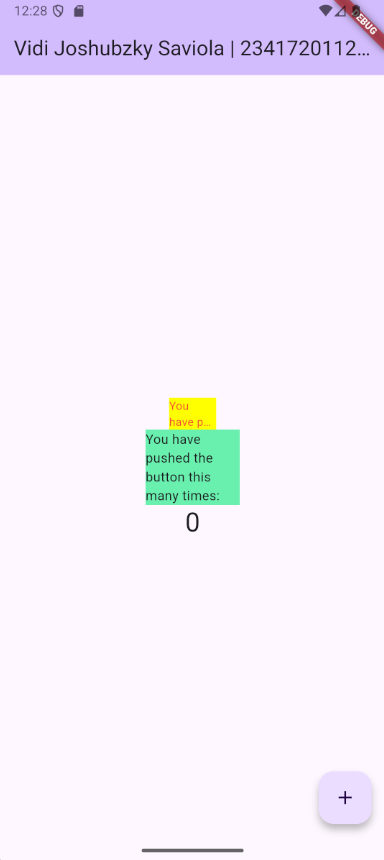

# Tugas Praktikum

## 1. Selesaikan Praktikum tersebut, lalu dokumentasikan dan push ke repository Anda berupa screenshot hasil pekerjaan beserta penjelasannya di file README.md!

### Langkah 1: Buat Project Baru

Buatlah sebuah project flutter baru dengan nama flutter_plugin_pubdev. Lalu jadikan repository di GitHub Anda dengan nama flutter_plugin_pubdev.


### Langkah 2: Menambahkan Plugin

Tambahkan plugin auto_size_text menggunakan perintah berikut di terminal



### Langkah 3: Buat file red_text_widget.dart

Buat file baru bernama red_text_widget.dart di dalam folder lib lalu isi kode seperti berikut.

```dart
import 'package:flutter/material.dart';

class RedTextWidget extends StatelessWidget {
  const RedTextWidget({super.key});

  @override
  Widget build(BuildContext context) {
    return Container();
  }
}
```

### Langkah 4: Tambah Widget AutoSizeText

Masih di file red_text_widget.dart, untuk menggunakan plugin auto_size_text, ubahlah kode return Container() menjadi seperti berikut.

```dart
return AutoSizeText(
      text,
      style: const TextStyle(color: Colors.red, fontSize: 14),
      maxLines: 2,
      overflow: TextOverflow.ellipsis,
);
```

Setelah Anda menambahkan kode di atas, Anda akan mendapatkan info error. Mengapa demikian? Jelaskan dalam laporan praktikum Anda!

### Terjadi error setelah menambahkan kode AutoSizeText, karena:

1. Error: "The method `AutoSizeText` isn't defined"

- Penyebab: Plugin `AutoSizeText` belum di-import ke dalam file `red_text_widget.dart`
- Diperbaiki dengan menambahkan import statement untuk plugin auto_size_text:

  ```dart
  import 'package:auto_size_text/auto_size_text.dart';
  ```

2. Error: "Undefined name `text`"

- Penyebab: Variabel text tidak didefinisikan dalam widget ini
- Diperbaiki dengan menambahkan parameter text di constructor widget:
  ```dart
  final String text;
  const RedTextWidget({super.key, required this.text});
  ```

Kode Lengkap:

```dart
import 'package:auto_size_text/auto_size_text.dart';
import 'package:flutter/material.dart';

class RedTextWidget extends StatelessWidget {
  final String text;
  const RedTextWidget({super.key, required this.text});

  @override
  Widget build(BuildContext context) {
    return AutoSizeText(
      text,
      style: const TextStyle(color: Colors.red, fontSize: 14),
      maxLines: 2,
      overflow: TextOverflow.ellipsis,
    );
  }
}
```

### Langkah 5: Buat Variabel text dan parameter di constructor

Tambahkan variabel text dan parameter di constructor seperti berikut.

```dart
final String text;
const RedTextWidget({super.key, required this.text});
```

### Langkah 6: Tambahkan widget di main.dart

Buka file main.dart lalu tambahkan di dalam children: pada class \_MyHomePageState

```dart
Container(
   color: Colors.yellowAccent,
   width: 50,
   child: const RedTextWidget(
             text: 'You have pushed the button this many times:',
          ),
),
Container(
    color: Colors.greenAccent,
    width: 100,
    child: const Text(
           'You have pushed the button this many times:',
          ),
),
```

Hasil:\


## 2. Jelaskan maksud dari langkah 2 pada praktikum tersebut!

Maksud dari perintah `flutter pub add auto_size_text` di terminal adalah secara otomatis mengunduh dan menambahkan package atau plugin bernama `auto_size_text` ke dalam proyek Flutter Anda.

## 3. Jelaskan maksud dari langkah 5 pada praktikum tersebut!

Maksud dari langkah 5 adalah menambahkan properti text bertipe String ke dalam widget `RedTextWidget` agar widget tersebut bisa menerima teks dari luar atau dari parent widget, sehingga widget tersebut dapat digunakan berkali-kali

## 4. Pada langkah 6 terdapat dua widget yang ditambahkan, jelaskan fungsi dan perbedaannya!

#### Widget Pertama (Container Kuning)

- Fungsi: Widget ini berfungsi untuk mendemonstrasikan kemampuan auto-sizing teks di dalam sebuah Container berwarna kuning dengan lebar 50 pixel.
- Komponen Utama: Menggunakan RedTextWidget, sebuah widget custom. Di dalam RedTextWidget ini terdapat AutoSizeText.
- Perilaku Teks: Karena menggunakan AutoSizeText, maka:
  - Ukuran font akan otomatis mengecil agar seluruh teks muat di dalam lebar 50 pixel.
  - Teks dibatasi maksimal 2 baris (maxLines: 2).
  - Jika masih tidak muat, teks akan dipotong dan diakhiri dengan tanda elipsis (...).
  - Warna teksnya adalah merah.

#### Widget Kedua (Container Hijau)

- Fungsi: Widget ini berfungsi untuk menampilkan teks yang sama di dalam sebuah Container berwarna hijau dengan lebar 100 pixel.
- Komponen Utama: Menggunakan widget Text standar dari Flutter.
- Perilaku Teks: Karena menggunakan widget Text standar:
  - Ukuran font tidak akan berubah (menggunakan ukuran default).
  - Teks akan otomatis pindah ke baris baru (wrapping) jika tidak muat dalam satu baris.
  - Jika teks terlalu panjang dan tidak muat bahkan setelah wrapping, akan muncul peringatan overflow (garis kuning-hitam) karena teks melebihi batas wadahnya.
  - Warna teksnya adalah hitam (warna default).

## 5. Jelaskan maksud dari tiap parameter yang ada di dalam plugin auto_size_text berdasarkan tautan pada dokumentasi ini !

parameter-parameter `AutoSizeText` adalah:
- text (String)
    - Teks yang akan ditampilkan
- textKey (Key?)
    - Key untuk widget AutoSizeText sendiri.
- style (TextStyle?)
    - Gaya dasar teks (font, warna, dll)
- minFontSize (double)
    - Ukuran huruf terkecil yang diizinkan saat mengecil otomatis
    - default 12.
- maxFontSize (double)
    - Ukuran huruf terbesar yang diizinkan
    - default batas atas double.
- stepGranularity (double)
    - “Langkah” penyusutan ukuran huruf
    - default 1 px
- presetFontSizes List<double>
- group (AutoSizeGroup?)
    - Objek grup agar beberapa AutoSizeText berbagi ukuran huruf yang sama.
- textAlign (TextAlign?)
    - Perataan teks (kiri, tengah, kanan, justify).
- textDirection (TextDirection?)
    - Arah teks (ltr / rtl).
- locale (Locale?)
    - Locale untuk soft-hyphen dan pemenggalan kata.
- softWrap (bool)
    - Izinkan wrap ke baris baru.
    - default true.
- wrapWords (bool)
    - Izinkan pemenggalan kata saat wrap.
    - default true.
- overflow (TextOverflow)
    - Cara menangani kelebihan teks (ellipsis, clip, fade, visible).
    - default ellipsis.
- overflowReplacement (Widget?)
    - Widget alternatif yang ditampilkan kalau teks tetap tidak muat.
- maxLines (int?)
    - Jumlah baris maksimum sebelum overflow.
    - null = tak terbatas.
- semanticsLabel (String?)
    - Label aksesibilitas bagi pembaca layar.
- textSpan (TextSpan?)
    - Gunakan TextSpan alih-alih string biasa untuk teks beranak & gaya campuran.

## 6. Kumpulkan laporan praktikum Anda berupa link repository GitHub kepada dosen!