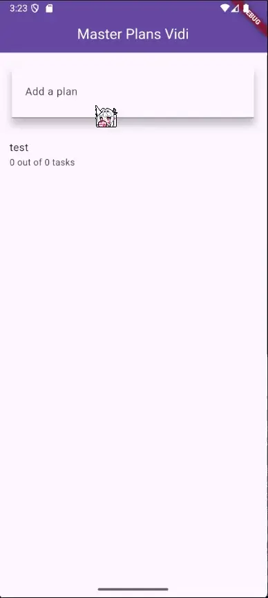

# Tugas Praktikum 1: Dasar State dengan Model-View

## 1. Selesaikan langkah-langkah praktikum tersebut, lalu dokumentasikan berupa GIF hasil akhir praktikum beserta penjelasannya di file README.md! Jika Anda menemukan ada yang error atau tidak berjalan dengan baik, silakan diperbaiki.

## Praktikum 1: Dasar State dengan Model-View

### Langkah 1: Buat Project Baru


### Langkah 2: Membuat model task.dart

```dart
class Task {
  final String description;
  final bool complete;

  const Task({this.complete = false, this.description = ''});
}
```

### Langkah 3: Buat file plan.dart

```dart
import 'task.dart';

class Plan {
  final String name;
  final List<Task> tasks;

  const Plan({this.name = '', this.tasks = const []});
}
```

### Langkah 4: Buat file data_layer.dart

```dart
export 'plan.dart';
export 'task.dart';
```

### Langkah 5: Pindah ke file main.dart

```dart
import 'package:flutter/material.dart';
import './views/plan_screen.dart';

void main() => runApp(MasterPlanApp());

class MasterPlanApp extends StatelessWidget {
  const MasterPlanApp({super.key});

  @override
  Widget build(BuildContext context) {
    return MaterialApp(
      theme: ThemeData(primarySwatch: Colors.purple),
      home: PlanScreen(),
    );
  }
}
```

### Langkah 6: buat plan_screen.dart

```dart
import '../models/data_layer.dart';
import 'package:flutter/material.dart';

class PlanScreen extends StatefulWidget {
  const PlanScreen({super.key});

  @override
  State createState() => _PlanScreenState();
}

class _PlanScreenState extends State<PlanScreen> {
  Plan plan = const Plan();

  @override
  Widget build(BuildContext context) {
    return Scaffold(
      appBar: AppBar(title: const Text('Master Plan Widi')),
      body: _buildList(),
      floatingActionButton: _buildAddTaskButton(),
    );
  }
}
```

### Langkah 7: buat method \_buildAddTaskButton()

```dart
Widget _buildAddTaskButton() {
  return FloatingActionButton(
    child: const Icon(Icons.add),
    onPressed: () {
      setState(() {
        plan = Plan(
          name: plan.name,
          tasks: List<Task>.from(plan.tasks)..add(const Task()),
        );
      });
    },
  );
}
```

### Langkah 8: buat widget \_buildList()

```dart
Widget _buildList() {
  return ListView.builder(
    itemCount: plan.tasks.length,
    itemBuilder: (context, index) => _buildTaskTile(plan.tasks[index], index),
  );
}
```

### Langkah 9: buat widget \_buildTaskTile

```dart
Widget _buildTaskTile(Task task, int index) {
  return ListTile(
    leading: Checkbox(
      value: task.complete,
      onChanged: (selected) {
        setState(() {
          plan = Plan(
            name: plan.name,
            tasks: List<Task>.from(plan.tasks)
              ..[index] = Task(
                description: task.description,
                complete: selected ?? false,
              ),
          );
        });
      },
    ),
    title: TextFormField(
      initialValue: task.description,
      onChanged: (text) {
        setState(() {
          plan = Plan(
            name: plan.name,
            tasks: List<Task>.from(plan.tasks)
              ..[index] = Task(description: text, complete: task.complete),
          );
        });
      },
    ),
  );
}
```

### Langkah 10: Tambah Scroll Controller

```dart
late ScrollController scrollController;
```

### Langkah 11: Tambah Scroll Listener

```dart
@override
void initState() {
  super.initState();
  scrollController = ScrollController()
    ..addListener(() {
      FocusScope.of(context).requestFocus(FocusNode());
    });
}
```

### Langkah 12: Tambah controller dan keyboard behavior

```dart
Widget _buildList() {
  return ListView.builder(
    controller: scrollController,
    itemCount: plan.tasks.length,
    itemBuilder: (context, index) => _buildTaskTile(plan.tasks[index], index),
  );
}
```

### Langkah 13: Terakhir, tambah method dispose()

```dart
@override
void dispose() {
  scrollController.dispose();
  super.dispose();
}
```

### Langkah 14: Hasil


## 2. Jelaskan maksud dari langkah 4 pada praktikum tersebut! Mengapa dilakukan demikian?

Maksud dari langkah ke 4 adalah untuk memudahkan proses import file di proyek, agar tidak ribet setiap kali membutuhkan akses ke model Plan dan Task.

## 3. Mengapa perlu variabel plan di langkah 6 pada praktikum tersebut? Mengapa dibuat konstanta ?

Variabel plan digunakan untuk menyimpan data utama yang ditampilkan di layar. Plan adalah model yang berisi daftar task dan juga nama task tersebut

## 4. Lakukan capture hasil dari Langkah 9 berupa GIF, kemudian jelaskan apa yang telah Anda buat!


Yang telah saya buat adalah komponen to do list yang interaktif, yang bisa ditambh, dicentang dan diedit teksnya.

## 5. Apa kegunaan method pada Langkah 11 dan 13 dalam lifecyle state ?

Kegunaan Langkah 11: initState():

- Inisialisasi ScrollController dan menambahkan listener.
- Listener ini menghilangkan fokus dari TextField ketika pengguna melakukan scroll (dengan FocusScope.of(context).requestFocus(FocusNode())).
- Dipanggil satu kali saat widget pertama kali dibuat, sebelum build() dijalankan.

Kegunaan Langkah 13: dispose():

- Membersihkan resource yang tidak lagi digunakan.
- Dipanggil saat widget dihapus dari tree.

# Tugas Praktikum 2: InheritedWidget

## 1. Selesaikan langkah-langkah praktikum tersebut, lalu dokumentasikan berupa GIF hasil akhir praktikum beserta penjelasannya di file README.md! Jika Anda menemukan ada yang error atau tidak berjalan dengan baik, silakan diperbaiki sesuai dengan tujuan aplikasi tersebut dibuat.

### Langkah 1: Buat file `plan_provider.dart`

Buat folder baru **`provider`** di dalam folder **`lib`**, lalu buat _file_ baru dengan nama **`plan_provider.dart`** berisi kode seperti berikut.

```dart
import 'package:flutter/material.dart';
import '../models/data_layer.dart';

class PlanProvider extends InheritedNotifier<ValueNotifier<Plan>> {
  const PlanProvider({
    super.key,
    required super.child,
    required ValueNotifier<Plan> super.notifier,
  });

  static ValueNotifier<Plan> of(BuildContext context) {
    return context
        .dependOnInheritedWidgetOfExactType<PlanProvider>()!
        .notifier!;
  }
}
```

### Langkah 2: Edit main.dart

Gantilah pada bagian atribut `home` dengan `PlanProvider` seperti berikut. Jangan lupa sesuaikan bagian impor jika dibutuhkan.

```dart
return MaterialApp(
  theme: ThemeData(primarySwatch: Colors.purple),
  home: PlanProvider(
    notifier: ValueNotifier<Plan>(const Plan()),
    child: const PlanScreen(),
   ),
);
```

### Langkah 3: Tambah method pada model plan.dart

Tambahkan dua method di dalam model `class Plan` seperti kode berikut.

```dart
int get completedCount => tasks
  .where((task) => task.complete)
  .length;

String get completenessMessage =>
  '$completedCount out of ${tasks.length} tasks';
```

### Langkah 4: Pindah ke PlanScreen

Edit `PlanScreen` agar menggunakan data dari `PlanProvider`. Hapus deklarasi variabel `plan` (ini akan membuat error). Kita akan perbaiki pada langkah 5 berikut ini.

### Langkah 5: Edit method \_buildAddTaskButton

Tambahkan `BuildContext` sebagai parameter dan gunakan `PlanProvider` sebagai sumber datanya. Edit bagian kode seperti berikut.

```dart
Widget _buildAddTaskButton(BuildContext context) {
  ValueNotifier<Plan> planNotifier = PlanProvider.of(context);
  return FloatingActionButton(
    child: const Icon(Icons.add),
    onPressed: () {
      Plan currentPlan = planNotifier.value;
      planNotifier.value = Plan(
        name: currentPlan.name,
        tasks: List<Task>.from(currentPlan.tasks)..add(const Task()),
      );
    },
  );
}
```

### Langkah 6: Edit method \_buildTaskTile

Tambahkan parameter **`BuildContext`**, gunakan **`PlanProvider`** sebagai sumber data. Ganti **`TextField`** menjadi **`TextFormField`** untuk membuat inisial data _provider_ menjadi lebih mudah.

```dart
void main() {
  runApp(
    const MaterialApp(
      home: PhotoFilterCarousel(),
      debugShowCheckedModeBanner: false,
    ),
  );
}
```

### Langkah 7: Edit \_buildList

Sesuaikan parameter pada bagian `_buildTaskTile` seperti kode berikut.

```dart
Widget _buildList(Plan plan) {
   return ListView.builder(
     controller: scrollController,
     itemCount: plan.tasks.length,
     itemBuilder: (context, index) =>
        _buildTaskTile(plan.tasks[index], index, context),
   );
}
```

### Langkah 8: Tetap di class PlanScreen

Edit method build sehingga bisa tampil progress pada bagian bawah (footer). Caranya, bungkus (wrap) \_buildList dengan widget Expanded dan masukkan ke dalam widget Column seperti kode pada Langkah 9.

### Langkah 9: Tambah widget SafeArea

Terakhir, tambahkan _widget_ **`SafeArea`** dengan berisi **`completenessMessage`** pada akhir _widget_ **`Column`**.

Perhatikan kode berikut ini.

```dart
@override
Widget build(BuildContext context) {
   return Scaffold(
     appBar: AppBar(title: const Text('Master Plan Widi')),
     body: ValueListenableBuilder<Plan>(
       valueListenable: PlanProvider.of(context),
       builder: (context, plan, child) {
         return Column(
           children: [
             Expanded(child: _buildList(plan)),
             SafeArea(child: Text(plan.completenessMessage))
           ],
         );
       },
     ),
     floatingActionButton: _buildAddTaskButton(context),
   );
}
```

### Hasil


## 2. Jelaskan mana yang dimaksud InheritedWidget pada langkah 1 tersebut! Mengapa yang digunakan InheritedNotifier?

Yang dimaksud sebagai `InheritedWidget` adalah class `PlanProvider`, karena class tersebut secara langsung **mewarisi (`extends`)** dari **`InheritedNotifier`**.

```dart
class PlanProvider extends InheritedNotifier<ValueNotifier<Plan>> { ... }
```

Mengapa yang digunakan `InheritedNotifier`? karena `InheritedNotifier` sendiri adalah implementasi khusus yang Flutter sediakan untuk memudahkan kita membuat InheritedWidget yang:

- Memiliki notifier (ChangeNotifier, ValueNotifier, dll...).
- Secara otomatis memanggil notifyClients() (yang memicu rebuild) setiap kali notifier mengeluarkan event.
- Tetap memberikan semua kemudahan InheritedWidget: data bisa diambil di mana saja di bawahnya dengan context.dependOnInheritedWidgetOfExactType() dan hanya rebuild bila data yang mereka gunakan berubah.

## 3. Jelaskan maksud dari method di langkah 3 pada praktikum tersebut! Mengapa dilakukan demikian?

Maksud dari kedua Method yang ditambahkan di langkah 3:

- `int get completedCount`: untuk menghitung jumlah tugas yang memiliki status bernilai true di dalam daftar tasks.
- `String get completenessMessage`: untuk membuat pesan string yang menunjukkan progress penyelesaian tugas, menggunakan hasil dari completedCount dan total tasks.length.

Mengapa dilakukan demikian? Dengan memisahkan logika ini, model menjadi self-contained dan kode di bagian View menjadi lebih bersih dan mudah dibaca karena tidak perlu lagi melakukan penghitungan progress secara manual.

## 4. Lakukan capture hasil dari Langkah 9 berupa GIF, kemudian jelaskan apa yang telah Anda buat!


Yang telah saya buat adalah memisahkan data dari tampilan, membuat View lebih efisien dan terpisah dari Logic. Serta menambahkan progress di bagian bawah layar

# Tugas Praktikum 3: State di Multiple Screens

## 1. Selesaikan langkah-langkah praktikum tersebut, lalu dokumentasikan berupa GIF hasil akhir praktikum beserta penjelasannya di file README.md! Jika Anda menemukan ada yang error atau tidak berjalan dengan baik, silakan diperbaiki sesuai dengan tujuan aplikasi tersebut dibuat.

### Langkah 1: Edit PlanProvider

Perhatikan kode berikut, edit class `PlanProvider` sehingga dapat menangani List Plan.

```dart
class PlanProvider extends
InheritedNotifier<ValueNotifier<List<Plan>>> {
  const PlanProvider({super.key, required Widget child, required
ValueNotifier<List<Plan>> notifier})
     : super(child: child, notifier: notifier);

  static ValueNotifier<List<Plan>> of(BuildContext context) {
    return context.
dependOnInheritedWidgetOfExactType<PlanProvider>()!.notifier!;
  }
}
```

### Langkah 2: Edit main.dart

Langkah sebelumnya dapat menyebabkan error pada `main.dart` dan `plan_screen.dart`. Pada method `build`, gantilah menjadi kode seperti ini.

```dart
Widget build(BuildContext context) {
  return PlanProvider(
    notifier: ValueNotifier<List<Plan>>(const []),
    child: MaterialApp(
      title: 'State management app',
      theme: ThemeData(
        primarySwatch: Colors.blue,
      ),
      home: const PlanScreen(),
    ),
  );
}
```

### Langkah 3: Edit plan_screen.dart

Tambahkan variabel `plan` dan atribut pada constructor-nya seperti berikut.

```dart
final Plan plan;
const PlanScreen({super.key, required this.plan});
```

### Langkah 4: Error

Itu akan terjadi error setiap kali memanggil `PlanProvider.of(context)`. Itu terjadi karena screen saat ini hanya menerima tugas-tugas untuk satu kelompok `Plan`, tapi sekarang `PlanProvider` menjadi list dari objek plan tersebut.

### Langkah 5: Tambah getter Plan

Tambahkan getter pada `_PlanScreenState` seperti kode berikut.

```dart
class _PlanScreenState extends State<PlanScreen> {
  late ScrollController scrollController;
  Plan get plan => widget.plan;
```

### Langkah 6: Method initState()

Pada bagian ini kode tetap seperti berikut.

```dart
@override
void initState() {
   super.initState();
   scrollController = ScrollController()
    ..addListener(() {
      FocusScope.of(context).requestFocus(FocusNode());
    });
}
```

### Langkah 7: Widget build

Pastikan Anda telah merubah ke `List` dan mengubah nilai pada `currentPlan` seperti kode berikut ini.

```dart
  @override
  Widget build(BuildContext context) {
    ValueNotifier<List<Plan>> plansNotifier = PlanProvider.of(context);

    return Scaffold(
      appBar: AppBar(title: Text(_plan.name)),
      body: ValueListenableBuilder<List<Plan>>(
        valueListenable: plansNotifier,
        builder: (context, plans, child) {
          Plan currentPlan = plans.firstWhere((p) => p.name == plan.
name);
          return Column(
            children: [
              Expanded(child: _buildList(currentPlan)),
              SafeArea(child: Text(currentPlan.
completenessMessage)),
            ],);},),
      floatingActionButton: _buildAddTaskButton(context,)
  ,);
 }

  Widget _buildAddTaskButton(BuildContext context) {
    ValueNotifier<List<Plan>> planNotifier = PlanProvider.
of(context);
    return FloatingActionButton(
      child: const Icon(Icons.add),
      onPressed: () {
        Plan currentPlan = plan;
        int planIndex =
            planNotifier.value.indexWhere((p) => p.name == currentPlan.name);
        List<Task> updatedTasks = List<Task>.from(currentPlan.tasks)
          ..add(const Task());
        planNotifier.value = List<Plan>.from(planNotifier.value)
          ..[planIndex] = Plan(
            name: currentPlan.name,
            tasks: updatedTasks,
          );
        plan = Plan(
          name: currentPlan.name,
          tasks: updatedTasks,
        );},);
  }
```

### Langkah 8: Edit \_buildTaskTile

Pastikan ubah ke `List` dan variabel `planNotifier` seperti kode berikut ini.

```dart
  Widget _buildTaskTile(Task task, int index, BuildContext context)
{
    ValueNotifier<List<Plan>> planNotifier = PlanProvider.
of(context);

    return ListTile(
      leading: Checkbox(
         value: task.complete,
         onChanged: (selected) {
           Plan currentPlan = plan;
           int planIndex = planNotifier.value
              .indexWhere((p) => p.name == currentPlan.name);
           planNotifier.value = List<Plan>.from(planNotifier.value)
             ..[planIndex] = Plan(
               name: currentPlan.name,
               tasks: List<Task>.from(currentPlan.tasks)
                 ..[index] = Task(
                   description: task.description,
                   complete: selected ?? false,
                 ),);
         }),
      title: TextFormField(
        initialValue: task.description,
        onChanged: (text) {
          Plan currentPlan = plan;
          int planIndex =
             planNotifier.value.indexWhere((p) => p.name ==
currentPlan.name);
          planNotifier.value = List<Plan>.from(planNotifier.value)
            ..[planIndex] = Plan(
              name: currentPlan.name,
              tasks: List<Task>.from(currentPlan.tasks)
                ..[index] = Task(
                  description: text,
                  complete: task.complete,
                ),
            );
},),);}
```

### Langkah 9: Buat screen baru

Pada folder **view**, buatlah file baru dengan nama `plan_creator_screen.dart` dan deklarasikan dengan `StatefulWidget` bernama `PlanCreatorScreen`. Gantilah di `main.dart` pada atribut home menjadi seperti berikut.

```dart
home: const PlanCreatorScreen(),
```

### Langkah 10: Pindah ke class \_PlanCreatorScreenState

Kita perlu tambahkan variabel `TextEditingController` sehingga bisa membuat `TextField` sederhana untuk menambah Plan baru. Jangan lupa tambahkan dispose ketika widget unmounted seperti kode berikut.

```dart
final textController = TextEditingController();

@override
void dispose() {
  textController.dispose();
  super.dispose();
}
```

### Langkah 11: Pindah ke method build

Letakkan method `Widget` build berikut di atas `void dispose`. Gantilah **‘Namaku'** dengan nama panggilan Anda.

```dart
@override
Widget build(BuildContext context) {
  return Scaffold(
    // ganti ‘Namaku' dengan nama panggilan Anda
    appBar: AppBar(title: const Text('Master Plans Namaku')),
    body: Column(children: [
      _buildListCreator(),
      Expanded(child: _buildMasterPlans())
    ]),
  );
}
```

### Langkah 12: Buat widget \_buildListCreator

Buatlah widget berikut setelah widget build.

```dart
Widget _buildListCreator() {
  return Padding(
     padding: const EdgeInsets.all(20.0),
     child: Material(
       color: Theme.of(context).cardColor,
       elevation: 10,
       child: TextField(
          controller: textController,
          decoration: const InputDecoration(
             labelText: 'Add a plan',
             contentPadding: EdgeInsets.all(20)),
          onEditingComplete: addPlan),
     ));
}
```

### Langkah 13: Buat void addPlan()

Tambahkan method berikut untuk menerima inputan dari user berupa text plan.

```dart
void addPlan() {
  final text = textController.text;
    if (text.isEmpty) {
      return;
    }
    final plan = Plan(name: text, tasks: []);
    ValueNotifier<List<Plan>> planNotifier =
PlanProvider.of(context);
    planNotifier.value = List<Plan>.from(planNotifier.value)..
add(plan);
    textController.clear();
    FocusScope.of(context).requestFocus(FocusNode());
    setState(() {});
}
```

### Langkah 14: Buat widget \_buildMasterPlans()

Tambahkan widget seperti kode berikut.

```dart
Widget _buildMasterPlans() {
  ValueNotifier<List<Plan>> planNotifier = PlanProvider.of(context);
    List<Plan> plans = planNotifier.value;

    if (plans.isEmpty) {
      return Column(
         mainAxisAlignment: MainAxisAlignment.center,
         children: <Widget>[
           const Icon(Icons.note, size: 100, color: Colors.grey),
           Text('Anda belum memiliki rencana apapun.',
              style: Theme.of(context).textTheme.headlineSmall)
         ]);
    }
    return ListView.builder(
        itemCount: plans.length,
        itemBuilder: (context, index) {
          final plan = plans[index];
          return ListTile(
              title: Text(plan.name),
              subtitle: Text(plan.completenessMessage),
              onTap: () {
                Navigator.of(context).push(
                   MaterialPageRoute(builder: (_) =>
PlanScreen(plan: plan,)));
              });
        });
}
```

### Hasil



## 2. Berdasarkan Praktikum 3 yang telah Anda lakukan, jelaskan maksud dari gambar diagram berikut ini! 

Diagram tersebut menjelaskan proses navigasi dan perubahan widget tree dalam aplikasi Flutter. Yang awalnya pohon Widget Awal (Blok Biru) ke Aksi "Navigator Push"

## 3. Lakukan capture hasil dari Langkah 14 berupa GIF, kemudian jelaskan apa yang telah Anda buat!


Yang telah saya buat adalah implementasi Manajemen State Multi-Screen. Hasil akhirnya adalah aplikasi yang memiliki dua layar utama.

